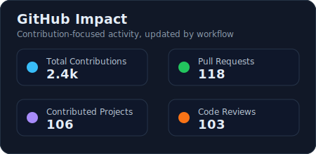
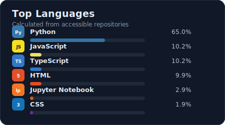

# Hey, I'm Suvam Paul  

  

  

---

## Who Am I?

I'm not just a web developer — I'm building myself into an **AI-powered Backend Full Stack Engineer**.

I love building **systems**, not just pages.  
My focus is on **backend architecture, authentication systems, AI integration, and scalable cloud deployment**.  
Currently crafting intelligent applications that bridge **AI automation** with real-world workflows.

> *"Frontend shows it. Backend runs it. AI makes it intelligent."*

 

---

### GitHub Stats

  
  

---
## My Favorite Tools

<h3>Core Languages</h3>

  

  
  
  

<h3>Frameworks & Libraries</h3>

  

<h3>Databases & Cloud</h3>

  

<h3>Currently Leveling Up</h3>

  

- **AWS** - EC2, Lambda, S3
- **Docker & Kubernetes** - Container Orchestration
- **Redis** - Caching & Session Management
- **GraphQL** - API Design

---

## Current Goals

🔹 Mastering **MERN Stack + Next.js + TypeScript**  
🔹 Building **secure authentication systems (JWT, OAuth, Roles)**  
🔹 Integrating **AI/ML models into web apps**  
🔹 Learning **Cloud (AWS), S3, Lambda, Api Gateway, Cloudwatch**  
🔹 Creating **production-level full stack systems**

---

---

## Featured Projects

<table>
<tr>
<td width="50%">

### [Portfolio](https://github.com/Suvam-paul145/portfolio)
**Personal Developer Portfolio Website**

Modern developer portfolio showcasing projects, skills, and achievements with a clean UI and responsive design.

`React` `TypeScript` `Tailwind CSS` `Vite`

</td>
<td width="50%">

### [SwasthaLink: AI Enabled Smart Hospital](https://github.com/Suvam-paul145/SwasthaLink)
**Digital Healthcare Connectivity Platform**

A healthcare platform enabling seamless interaction between patients and providers with a focus on accessibility and digital health records.

`Next.js` `TypeScript` `Node.js` `MongoDB` `REST API`

</td>
</tr>

<tr>
<td width="50%">

### [FixFlowAI: Build for Freelancer and Agencies](https://github.com/Suvam-paul145/FixFlowAI)   
****

AI-powered client brief → structured proposal generator · Streaming JSON · Confidence Grid · Built for agencies and freelancers. Task job scheduler and Email Automations.
`javascript` `dockerfile` `html5` `mongodb` `reactjs` `aws-s3` `node-js` `express-js` `aws-cloudfront` `aws-amplify` `tailwind-css` `aws-ecs-fargate`

</td>
<td width="50%">

### [Retro-Revival](https://github.com/Suvam-paul145/Retro-revival)
**Classic Gaming Experience Reimagined**

A nostalgic web-based gaming project reviving retro-style gameplay with modern web technologies and smooth UI interactions.

`JavaScript` `HTML` `CSS` `Canvas API`

</td>
</tr>
</table>

---

### Contribution Streak

  

---

## Activity Graph

---

## Contribution        

--- 

## Let's Connect

  

---

  
### 💡 *"Building intelligent systems that make a difference"*

