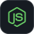

### Built & building

- [FixFlowAI](https://github.com/FixFlow-AI) — a freelancing platform with state-machine-based escrow payments, audit trails, and AI-assisted skill verification. Built with Node.js, React, and AWS.
- [Take U Forward](https://github.com/Subhratanu-Saha/take-you-forward-app) — led a team building a retail backend with Express, Prisma, and PostgreSQL, including request tracing, structured logging, and deployment.
- [Stock research agent](https://github.com/Suvam-paul145/Stock-market-agent) — building a personal research tool around company filings and source-backed analysis, with trading decisions kept meaningful.

### Achievements

As a project mentor at **Apertre 3.0**, I reviewed pull requests, helped contributors find suitable issues, and guided them through Git and project decisions.

### Tools & direction

  
  
  
  
  
  
  
  
  
  
  
  
  
  
  
  
  
  

I prefer small systems I can understand, afford, and improve.

[Portfolio source](https://github.com/Suvam-paul145/portfolio) · [LinkedIn](https://www.linkedin.com/in/suvam-paul-03222005az/) · [Email](mailto:suvampaul145@gmail.com)